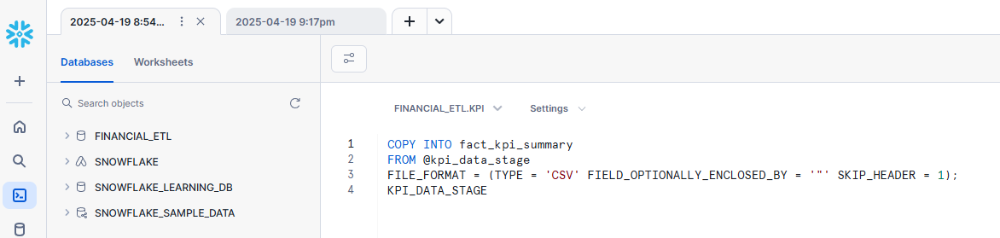
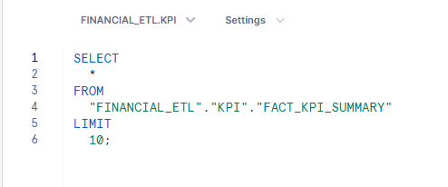

# 📊 Financial ETL Datalake Pipeline

This project simulates a **real-world ETL pipeline** for processing financial KPIs across departments. It integrates **PySpark**, **Snowflake**, and **Power BI** to ingest, transform, and visualize financial data for decision-making.

---

## 🚀 Project Overview

**Objective:** Build a scalable pipeline to process and monitor financial KPIs (e.g., cash flow, expenses, targets) across departments.

**Tools & Tech Stack:**
- `PySpark` (ETL and transformations)
- `Snowflake` (data warehouse + SQL loading)
- `Google Colab` (development environment)
- `Power BI` (visual dashboard)
- `GitHub` (version control)

---

## 🧪 Key Features

- ✅ Generate mock financial datasets with Faker
- 🔄 Join, clean, and transform data with PySpark
- 🧊 Load cleaned data into Snowflake `fact_kpi_summary` table
- 📈 Visualize KPIs in Power BI: budget vs actuals, department comparisons
- 📦 Export zipped output and SQL integration-ready tables

---

## 📂 Folder Structure
Financial-ETL-Datalake-Pipeline/ ├── SnowFlake/ │ ├── schema.sql # Snowflake table & schema setup │ └── copy_into.sql # Load data from stage ├── Screenshots/ │ └── uploaded_table_sample.png # Visual proof of Snowflake load ├── notebooks/ │ └── Financial_ETL_Datalake_Pipeline.ipynb └── README.md

---

## 📸 Preview

| KPI Snowflake Table | Fact KPI Summary View |
|---------------------|------------------------|
|  |  |

---

## 🧠 What I Learned

- Setting up a real-world Snowflake schema with staging and COPY commands
- Writing robust PySpark ETL pipelines in Colab
- Automating KPI aggregation with joins and date parsing
- Troubleshooting schema mismatches between PySpark and Snowflake
- Deploying a reproducible project from notebook → database → dashboard

---

## 🔗 Future Enhancements

- Add DBT integration for transformation layer
- Automate Snowflake uploads via Python + Streamlit
- Schedule ETL pipelines via Airflow or dbt Cloud

---

## 📌 Author

**Yengkong Sayaovong**  
[LinkedIn](https://www.linkedin.com/in/ysayaovong) | [GitHub](https://github.com/YSayaovong)

---

> ⭐ If you found this helpful, give the repo a star!

