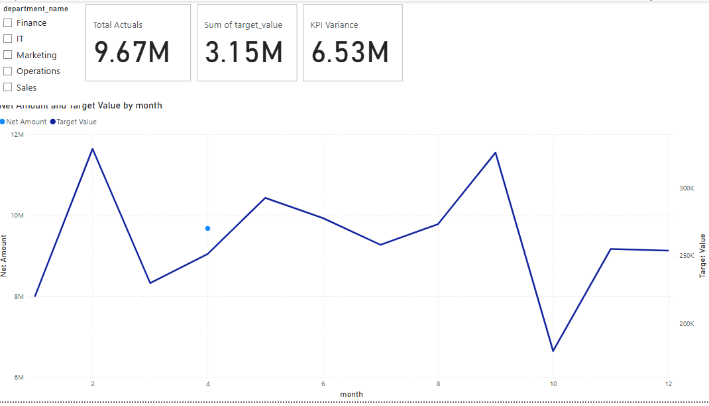
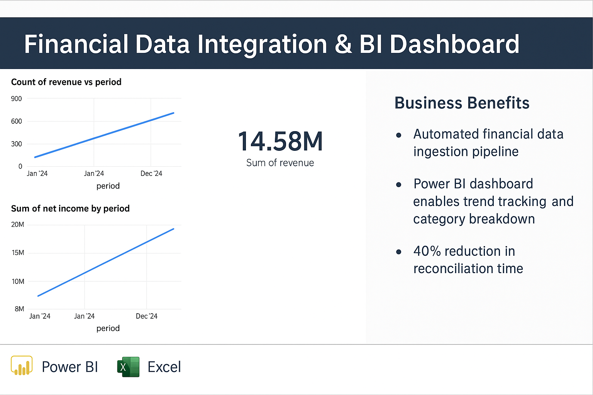

# 💼 Financial ETL Datalake Pipeline

This project demonstrates a full-stack ETL pipeline for financial KPI analysis using **PySpark**, **Snowflake**, and **Power BI**. It automates ingestion, transformation, and executive reporting of KPI data.

---

## 📌 Key Features

- Built a PySpark pipeline to process transactions, invoices, and expenses from mock financial datasets.
- Created a Snowflake schema (`FINANCIAL_ETL.KPI`) and loaded data via internal stage and `COPY INTO` operations.
- Queried final outputs with Snowflake SQL to verify data integrity.
- Built a Power BI dashboard to visualize real-time performance, variance, and trends across departments.

---

## 🧱 Tech Stack

| Layer       | Tool            |
|-------------|-----------------|
| ETL         | Python, PySpark |
| Datalake    | Snowflake       |
| BI / Viz    | Power BI        |
| Source Data | CSV (mock data) |

---

## 📊 Power BI Dashboard

**KPI Variance Summary:**

Displays overall financial KPI variance by comparing actual and target values.

---

**Snowflake Data Validation:**

Query confirmation using `SELECT * FROM FACT_KPI_SUMMARY` to validate loaded output.

---

**Executive Dashboard View:**

Clean Power BI dashboard displaying total net amount, target value, and KPI variance card.

---

## 📁 Folder Structure
Financial-ETL-Datalake-Pipeline/  
├── data/  
│   └── kpi_summary.csv  
├── SnowFlake/  
│   ├── ddl_create_tables.sql  
│   ├── copy_into_stage.sql  
│   └── select_final_output.sql  
├── PowerBI/  
│   └── Financial-KPI.pbix  
├── Screenshots/  
│   ├── kpi_summary.PNG  
│   ├── financial_etl_kpi.PNG  
│   └── power_bi.PNG  
├── README.md  
├── .gitignore

---
## 🔎 BI Output Example
Below is a preview of the Power BI dashboard powered by the cleaned data from this ETL pipeline:

- 📊 Monthly Revenue Trends
- 📈 Forecasted Net Income
- 💡 KPI Summary Cards

---
## 🧠 Author

Built by **Yengkong Sayaovong**. Designed to showcase end-to-end data engineering and BI integration skills.

---

## ✅ Status

✅ **Complete** – Deployed and ready

